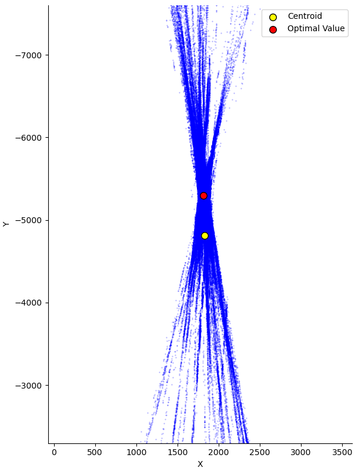
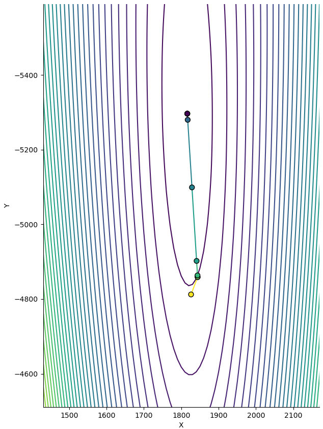

# Leveraging the Levenberg-Marquardt Method for Vanishing Point Detection

This repository contains code and illustrations for the tutorial "Leveraging the Levenberg-Marquardt Method for Vanishing Point Detection in Computer Vision Tasks"

## File Structure

The repository has the following files:

- **main.py**: Entry point for running the optimization task.
- **lm_solver.py**: Implements the Levenberg-Marquardt solver.
- **optimization_task.py**: Defines the OptimizationTask abstract base class.
- **vp_optimization_task.py**: Implements the VanishingPointOptimizationTask, a specific instance of OptimizationTask.
- **util.py**: Contains utility functions.
- **README.md**: The document you are currently reading.

Additionally, there are directories:

- **data**: Contains input images.
- **doc**: Holds images used for illustrations in this file.

## Getting Started

### Prerequisites

Make sure you have Python installed. Install the project dependencies using:

```bash
pip install -r requirements.txt
```

## Running the Script
To execute the vanishing point detection, run the main.py script, providing the path to the input image. After execution, it prints the homogeneous coordinates (x, y, z) of the found vanishing point. 

```bash
python main.py --input data/input_image.jpg
```

## Illustrations


The image shows 660 detected line segments forming a vertical vanishing point.



Zoomed-in view of pairwise line intersections of the detected segments, their centroid (yellow), and the found MLE-optimal vanishing point location (red).



The image displays the error function level set and estimated vanishing point locations through the Levenberg-Marquardt method iterations.

## Acknowledgments
The implementation is inspired by the "A note on computing vanishing points" section in the book "Multiple View Geometry" by Richard Hartley and Andrew Zisserman. The section highlights that the simple centroid calculation of the vanishing point is not MLE optimal and suggests using the non-linear least squares optimization method.